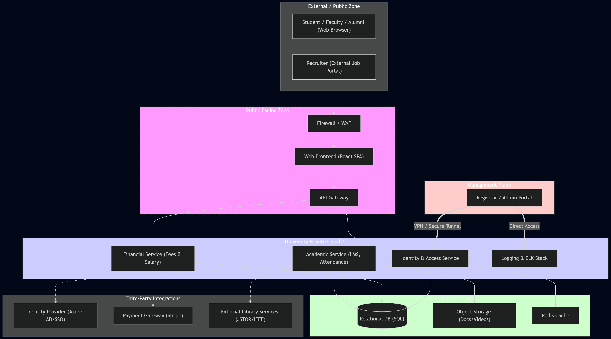
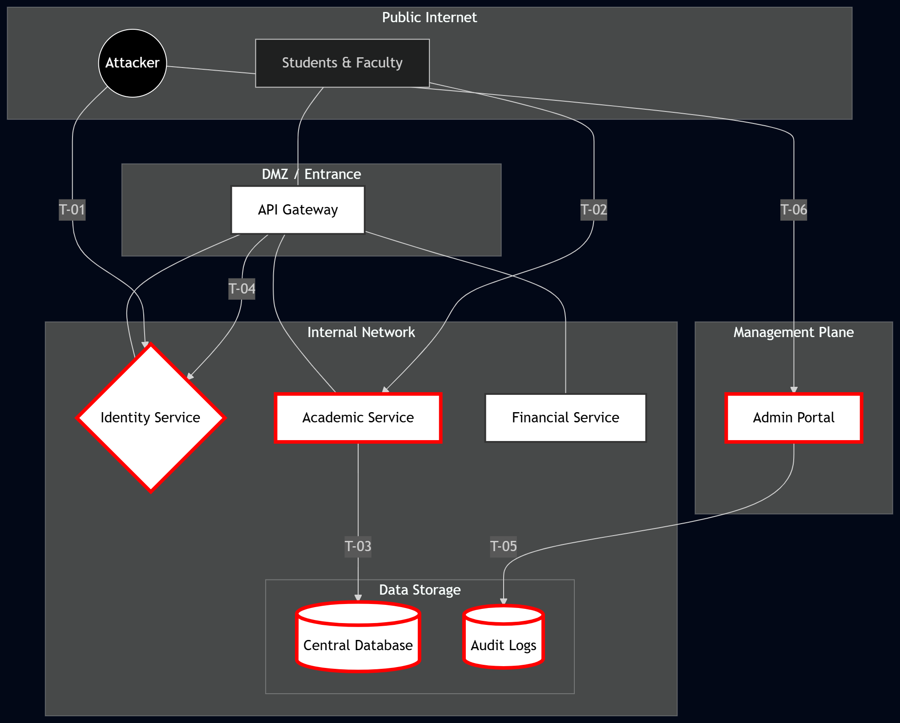
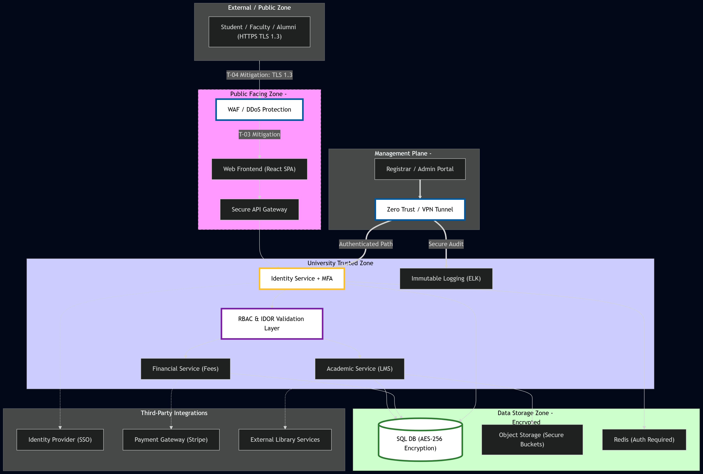

#  Secure Architecture & Design: University Management System (UMS)

##  Task 1: System Definition and Architecture

### 1.1 Application Components
The University Management System (UMS) is a service-oriented application designed to handle academic, financial, and administrative functions.

* **Web Portal (Frontend):** A React-based SPA providing interfaces for Students, Faculty, and Admins.
* **API Gateway:** The central entry point for all traffic, managing routing and SSL termination.
* **Identity Service:** Manages AuthN/AuthZ and RBAC, integrating with External IdPs (Azure AD).
* **Academic Service:** Handles LMS features, grade entries, and attendance tracking.
* **Financial Service:** Manages student fee processing and faculty payroll.
* **Data Layer:** Consists of a Central SQL Database for structured records and Object Storage for course files.

### 1.2 Architecture Diagram

---

##  Task 2: Asset Identification

### 2.1 Asset Inventory Table

| Asset ID | Asset Name | Description | Data Type | Location |
| :--- | :--- | :--- | :--- | :--- |
| **A-01** | **User Credentials** | Salted/Hashed passwords and MFA tokens. | Secrets | Identity DB |
| **A-02** | **Student PII** | Names, CNICs, and medical records. | Personal Data | Relational DB |
| **A-03** | **Grade Records** | Final grades and official transcripts. | Academic | Relational DB |
| **A-04** | **Financial Ledgers** | Fee payments and faculty payroll data. | Financial | Financial DB |

---

##  Task 3: Structured Threat Modeling (OWASP)

### 3.1 Threat Model Table

| Threat ID | Threat Area | OWASP Category | Description | Affected Component | Risk Level |
| :--- | :--- | :--- | :--- | :--- | :--- |
| **T-01** | **Authentication** | **Auth Failures (A07)** | Brute force or credential stuffing targeting Faculty accounts. | Identity Service | **High** |
| **T-02** | **Authorization** | **Broken Access Control (A01)** | Student uses IDOR to view/edit another student's grade records. | Academic Service | **High** |
| **T-03** | **Data Storage** | **Injection (A03)** | SQL Injection used to dump the entire Fee/Payroll database. | Relational DB | **High** |
| **T-04** | **API Comm.** | **Cryptographic Failures (A02)** | Sensitive PII transmitted over unencrypted or weak TLS channels. | API Gateway | **Medium** |
| **T-05** | **Logging** | **Monitoring Failures (A09)** | Unauthorized grade changes occur without being captured in logs. | Logging System | **High** |
| **T-06** | **Admin Access** | **Security Misconfig (A05)** | Admin portal exposed to public internet without VPN/IP white-listing. | Admin Portal | **High** |

### 3.2 Risk Reasoning
* **T-01 (Authentication):** Faculty accounts are high-value targets. Compromise leads to leaked exams and mass grade manipulation.
* **T-02 (Authorization):** If access control is broken, the trust boundary between student and faculty roles disappears.
* **T-03 (Injection):** Data integrity loss in a university database is irreversible and destroys institutional credibility.
* **T-04 (API Communication):** Requires an active "Man-in-the-Middle" attacker, making it slightly less probable than direct web exploits.
* **T-05 (Logging):** Accountability is required for financial compliance. Without logs, insider fraud remains undetected.
* **T-06 (Admin Access):** The Admin Portal has "god-mode" permissions; public exposure is a critical architectural flaw.

### 3.3 Threat Diagram

---

##  Task 4: Secure Architecture Design

### 4.1 Updated Architecture Diagram

### 4.2 Security Control Justifications

| Control ID | Category | Proposed Control | Justification (Risk Mitigation) |
| :--- | :--- | :--- | :--- |
| **C-01** | **IAM** | **Multi-Factor Auth (MFA)** | Mitigates **T-01**: Prevents account takeover even if passwords leak. |
| **C-02** | **Logic** | **Server-Side RBAC** | Mitigates **T-02**: Ensures users only access data permitted by their role. |
| **C-03** | **Network** | **Web App Firewall (WAF)** | Mitigates **T-03**: Filters SQLi and XSS patterns at the perimeter. |
| **C-04** | **Data** | **AES-256 & TLS 1.3** | Mitigates **T-04**: Protects data-in-transit and at-rest via strong encryption. |
| **C-05** | **Logging** | **Immutable Audit Logs** | Mitigates **T-05**: Ensures a permanent, tamper-proof record of sensitive changes. |
| **C-06** | **Network** | **VPN / IP Whitelisting** | Mitigates **T-06**: Removes the Admin Portal from the public internet. |

---

##  Task 5: Risk Treatment and Residual Risk

### 5.1 Risk Treatment Table

| Threat ID | Threat Name | Risk Level | Treatment Strategy | Mitigation Action |
| :--- | :--- | :--- | :--- | :--- |
| **T-01** | Auth Failures | **High** | **Mitigate** | Enforce MFA and strict account lockout policies. |
| **T-02** | Access Control | **High** | **Mitigate** | Deploy centralized RBAC validation for all API calls. |
| **T-03** | Injection | **High** | **Mitigate** | Implement WAF filtering and enforced parameterized SQL queries. |
| **T-04** | Crypto Failures | **Medium** | **Mitigate** | Enforce TLS 1.3 for transit and AES-256 for data at rest. |
| **T-05** | Logging Failure | **High** | **Mitigate** | Stream logs to an immutable ELK stack. |
| **T-06** | Admin Exposure | **High** | **Avoid** | Isolate Admin Portal behind a Zero-Trust VPN tunnel. |

### 5.2 Residual Risk Explanation
Despite robust controls, some residual risk remains:
* **Social Engineering:** Users may fall victim to phishing or MFA-fatigue, potentially bypassing **C-01**.
* **Zero-Day Vulnerabilities:** Unknown flaws in the WAF (**C-03**) or DB engine could be exploited before patches exist.
* **Insider Threats:** Authorized admins with VPN access (**C-06**) could abuse permissions, though **C-05** provides an audit trail.
* **Logic Errors:** Complex RBAC rules (**C-02**) may contain bugs allowing over-privileged access in specific edge cases.

---

##  Task 6: Final Summary

### 6.1 System Overview
The UMS has been transformed from a vulnerable, public-facing system into a hardened, "Secure-by-Design" environment. By applying defense-in-depth principles, we have addressed the critical OWASP vulnerabilities identified in the initial assessment.

### 6.2 Assumptions and Limitations
* **Assumptions:** Third-party integrations (Stripe, Azure AD) are assumed to maintain their own SOC2/PCI-DSS compliance.
* **Limitations:** This report focuses on web architecture and does not cover physical data center security or end-user device security.
* **Availability:** High-security posture assumes ongoing budget for WAF/VPN licensing and security personnel to monitor logs.

---

